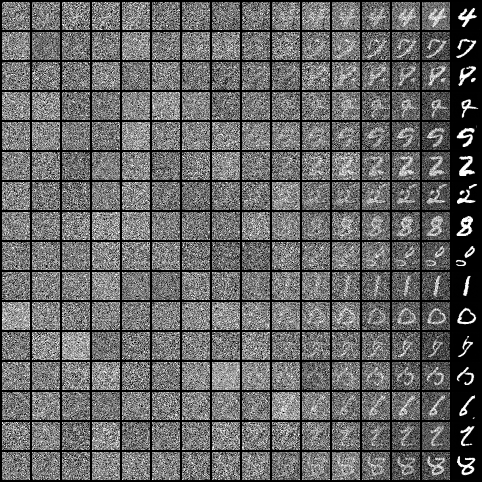
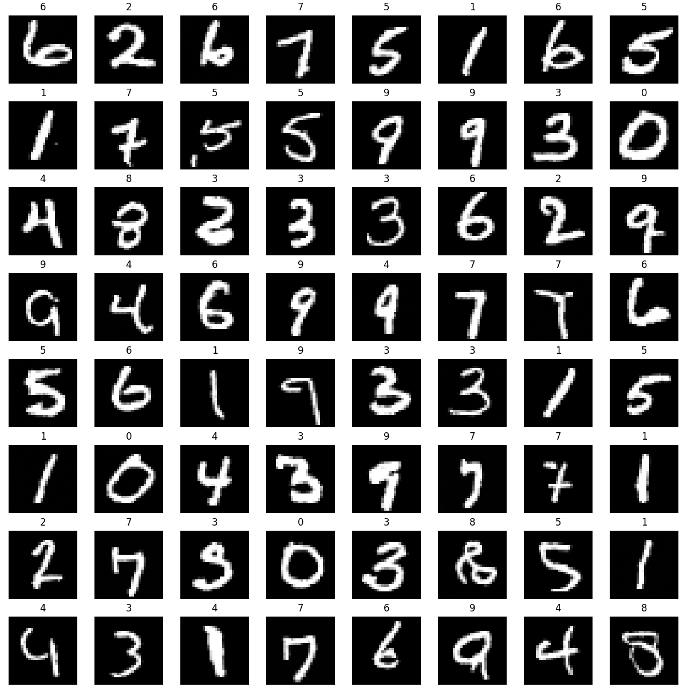
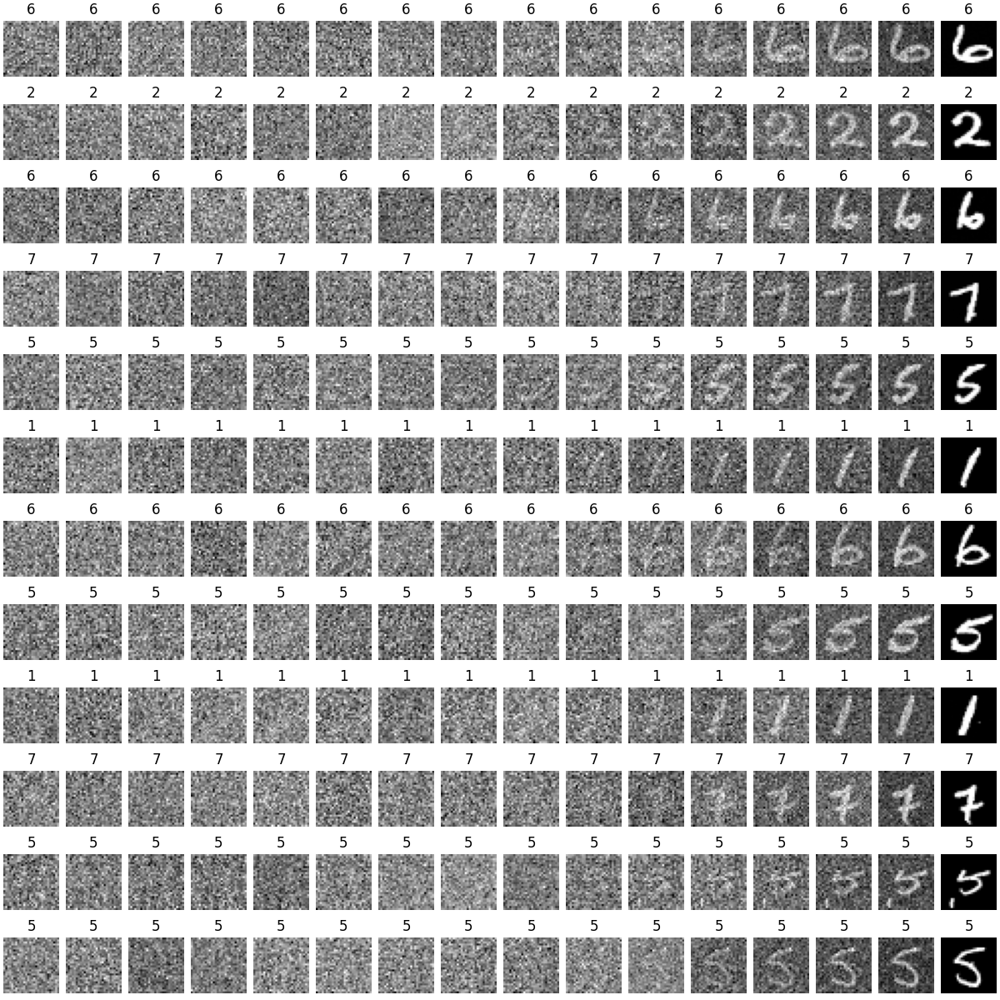

# PyTorch-DDPM-Demo

PyTorch implementation of DDPM Demo and Classifier-Free DDPM Demo.
Experiments were conducted on MNIST and Cifar10 datasets.

## Development Environment

- Red Hat Enterprise Linux Server release 7.6 (Maipo)
- pytorch 1.6.0
- torchvision 0.7.0
- python 3.7.16

## Requirements
- Download dataset and pth file from DDPM-Demo file:

    [DDPM-Demo](https://www.aliyundrive.com/s/rpqX43VFfpT)
## Project structure
├── classifier_free_ddpm  \
│　　├── models  \
│　　└── photos  \
│　　└── ...  \
├── datasets  \
├── ddpm  \
│　　├── models  \
│　　└── photos  \
│　　└── ...  \
└── README.md

## Train 

MNIST:
```python
python train.py -b 64 -d 0 -e 20 -t 500
```

Cifar10:
```python
python train.py -b 64 -d 1 -e 100 -t 1000
```

Parameter meaning:

| abbreviation   | full name           | meaning                          |
|----------------|---------------------|----------------------------------|
| -b             | --batch_size        | batch size                       |
| -d             | --datasets_type     | datasets type,0:MNISI,1:Cifar-10 |
| -e             | --epochs            | epochs                           |
| -t             | --timesteps         | timesteps                        |
| -dp            | --datasets_path     | path of the Datasets             |


## Evaluate

MNIST:
```python
python inference.py -b 64 -d 0 -t 500 -p models/mnist-500-20-0.0005.pth
```

Cifar10:
```python
python inference.py -b 64 -d 1 -t 1000 -p models/cifar10-1000-100-0.0002.pth
```

## Experimental Result

### DDPM

#### MNIST:




#### CIFAR10:


### Classifier-Free DDPM
#### MNIST:




#### CIFAR10:


## Reference

[PyTorch-DDPM](https://github.com/LinXueyuanStdio/PyTorch-DDPM)


